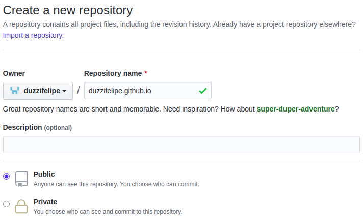
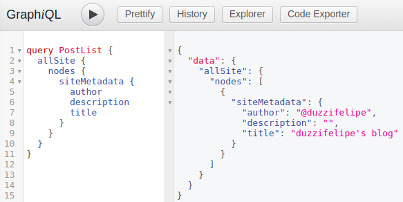
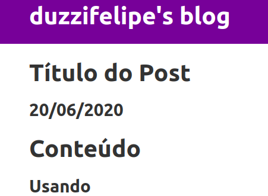

Este é o primeiro post do meu blog e a ideia é documentar, de maneira simples, como fiz a configuração do projeto utilizando os seguinte recursos:
- [Gatsby](https://www.gatsbyjs.org/) - framework para criação de sites estáticos utilizando [React](https://pt-br.reactjs.org/);
- [Markdown](https://daringfireball.net/projects/markdown/) - sintaxe para escrita fácil de texto que converte para estrutura HTML;
- [Github Pages](https://pages.github.com/) - hospedagem para sites estáticos e de graça, desde que o repositório seja público;
- [Github Actions](https://github.com/features/actions) - ferramenta do Github que permite rodar rotinas após ações no repositório (ex: novos commits);
- [Prism.js](https://prismjs.com/) - biblioteca para highlight de código (na linguagem comum: colocar corzinha no código).

O principal intuito dessa configuração é aprender um pouquinho sobre Gatsby e colocar algo no ar que não me gere custos nem dificuldade para manter.

Vou tentar ser o mais breve possível porque são muitos passos para agrupar em um único post, mas deixarei em cada passo os links para outros posts com maiores detalhes e configurações.

### Instalando o que é necessário

Para desenvolvimento, você irá precisar de um ambiente com Node.js instalado, além do cliente do Gatsby.

Se você ainda não tem Node.js e npm instalado, siga o documento oficial por aqui: https://nodejs.org/pt-br/download/package-manager/.

Você também vai precisar do Git instalado em sua máquina (https://git-scm.com/downloads) e de uma conta no Github (https://github.com/).

Tendo o Node.js instalado, agora instale o cliente do gatsby em modo global (`-g`):

```bash
npm install -g gatsby-cli
```

### Criando novo projeto

Antes de começar com o código do blog, [crie um repositório no Github](https://github.com/new) com o nome no padrão `seu-usuario.github.io`. O meu, por exemplo, será `duzzifelipe.github.io`, conforme o print abaixo:



Em seguida, crie um novo projeto utilizando o comando `gatsby new` e use o mesmo nome do repositório que acabou de criar:

```bash
gatsby new duzzifelipe.github.io
```

Dentro da pasta, recém criada, adicione o repositório que acabou de criar como o `git remote` do projeto:

```bash
git remote add origin git@github.com:duzzifelipe/duzzifelipe.github.io.git
```

Você já pode fazer o primeiro `push` já que o comando do gatsby criou um commit inicial com o código gerado.

```bash
git checkout -b gatsby-master
git push origin gatsby-master
```

### Configurando o Gatsby para o Github Pages

Por padrão, o Github Pages procura por um projeto funciona em repositórios do [Jekyll](https://jekyllrb.com/) (uma alternativa ao Gatsby) ou com projetos puramente HTML (com um index.html). Não temos nada disso em nosso repositório.

O Github Pages possui um pacote no npm, assim como o Gatsby, que permite fazer o deploy deste projeto ([tutorial do gatsby](https://www.gatsbyjs.org/docs/how-gatsby-works-with-github-pages/)). Mas não o instalerei localmente para delegar essa responsabilidade ao Github Actions.

É necessário instalar o pacote do `gh-pages` no projeto com o comando:

```shell
npm i --save gh-pages
```

Em seguida, atualizar o arquivo `package.json` para incluir o seguinte comando de deploy:

```json
"scripts": {
  ...
  "deploy": "gh-pages -d public -b master -r https://$GITHUB_TOKEN@github.com/$GITHUB_REPOSITORY"
},
```

**Há uma pequena complicação no Github**: o Github Pages exige que o HTML final esteja na branch `master`; então precisaremos usar outra branch como padrão (`gatsby-master`) e deixar o deploy apontando para a `master` - isso é um [problema conhecido](https://www.gatsbyjs.org/docs/how-gatsby-works-with-github-pages/#deploying-to-a-github-pages-subdomain-at-githubio).

Caso seu repositório já tenha a branch `master`, você deve alterar em `Seu Repositório > Settings > Branches`. (para meu repositório, o link é: https://github.com/duzzifelipe/duzzifelipe.github.io/settings/branches). Um lembrete: a nova branch base já deve existir no Github.

Em seu repositório, crie a seguinte configuração em `.github/workflows/gh-pages.yml`:

```yml
name: Deploy Github Pages
on:
  push:
    branches: gatsby-master
jobs:
  build-deploy:
    runs-on: ubuntu-latest
    container:
      image: node:12-buster
    steps:
    - uses: actions/checkout@v1
    - name: Setup Git
      run: git config --global user.email duzzifelipe@gmail.com
    - name: Setup Global
      run: npm install -g gatsby-cli
    - name: Install Packages
      run: npm install
    - name: Build App
      run: npm run build
    - name: Deploy
      run: npm run deploy
      env:
        GITHUB_TOKEN: ${{ secrets.GH_TOKEN }}
        GITHUB_REPOSITORY: ${{ github.repository }}
```

### Configurando a secret GH_TOKEN

Para finalizar, a action usa uma variável de ambiente chamada `GH_TOKEN`. A mesma precisa ser criada manualmente para dar as permissões necessárias ao comando `gh-pages`.

Vá a página https://github.com/settings/tokens/new e crie um novo token com apenas o scope `repo`.

Em seguida, acesse as configurações de seu repositório na aba "Secrets" e adicione a variável `GH_TOKEN` com o valor copiado do passo anterior.

A partir de agora, qualquer novo `git push origin gatsby-master` deve acionar o build automático e publicar a página com as alterações.

### Explorando o app inicial

Agora, dentro da pasta do projeto, você pode iniciar a aplicação rodando o comando:

```bash
npm start
```

A aplicação iniciará na porta `8000` (http://localhost:8000/) e também fornecerá uma página onde você pode testar suas queries do GraphQL (`http://localhost:8000/___graphql`).



### Limpando o código de exemplo

Para dar continuidade na criação deste blog, alguns recursos que vêm como padrão ao criar o projeto Gatsby podem ser removidos.

Os arquivos que você pode deletar são:
- `src/pages/page-2.js`;
- `src/pages/using-typescript.tsx`
- `src/images/gatsby-astronaut.png`

Você pode alterar o arquivo `src/pages/index.js` para ficar com o seguinte conteúdo no momento (uma página praticamente vazia, onde colocaremos a lista de posts futuramente):
```jsx
import React from "react"
import { Link } from "gatsby"

import Layout from "../components/layout"
import SEO from "../components/seo"

const IndexPage = () => (
  <Layout>
    <SEO title="Home" />
  </Layout>
)

export default IndexPage
```
Em seguida, você pode personalizar as configurações de metadata do seu blog no arquivo `gatsby-config.js`:
```javascript

siteMetadata: {
  title: `duzzifelipe's blog`,
  description: `Um blog sobre desenvolvimento`,
  author: `@duzzifelipe`,
},
...
```

### Carregar os posts Markdown

Para escrever os posts deste blog, não pretendo usar nenhuma ferramenta de conteúdo como Wordpress, Strapi e etc. Seguirei pelo caminho de usar arquivos Markdown (já explicados no início do post). A documentação oficial do Gatsby pode ser acessada neste link: https://www.gatsbyjs.org/docs/adding-markdown-pages/.

Para o devido carregamento dos arquivos Markdown e conversão para HTML, você precisará instalar a seguinte dependência:

```bash
npm install --save gatsby-transformer-remark
```

Em seguida, adicionar a configuração necessária para a dependência no arquivo `gatsby-config.js`:

```javascript
plugins: [
  ...
  {
    resolve: `gatsby-source-filesystem`,
    options: {
      name: `markdown-pages`,
      path: `${__dirname}/src/markdown-posts`,
    },
  },
  `gatsby-transformer-remark`,
  ...
```
> Note que ao especificar o `path: \`${__dirname}/src/markdown-posts\``, essa pasta será o local onde os posts deverão ser escritos.

Antes de continuar, crie um novo arquivo Markdown na pasta `/src/markdown-posts` com o nome que desejar, seguindo o padrão abaixo:

```markdown
---
slug: a-slug-deve-ser-separada-por-hifen-e-ficara-na-url-do-post
title: Título do Post
date: 2020-06-20
---

# Conteúdo
## Usando
### Sintaxe
#### Markdown
```

Volte à página do GraphQL (`http://localhost:8000/___graphql`) e insira a query abaixo. Ela deverá retornar em ordem decrescente de data (pelo campo `date`) e retornar título, slug e data do post (para usarmos na página inicial do blog).

```graphql
query PostList {
  allMarkdownRemark(sort: {order: DESC, fields: [frontmatter___date]}) {
    edges {
      node {
        frontmatter {
          slug
          date
          title
        }
      }
    }
  }
}

```
> o `frontmatter` é o espaço delimitado por "---" no arquivo markdown e permite criar campos customizaodos.

### Exibindo os posts na página index

A página inicial do blog deverá conter uma lista dos títulos das postagens (em ordem decrescente de data) e ter um link para para cada uma.

Alterei o código para incluir a query que rodamos no passo anterior e para montar uma lista a partir de seus resultados.

O novo conteúdo da página deve ser o seguinte:

```jsx
import React from "react"
import { Link } from "gatsby"
import { useStaticQuery, graphql } from "gatsby"

import Layout from "../components/layout"
import SEO from "../components/seo"

const IndexPage = () => {
  const posts = useStaticQuery(graphql`
    query PostList {
      allMarkdownRemark(sort: {order: DESC, fields: [frontmatter___date]}) {
        edges {
          node {
            frontmatter {
              slug
              date(formatString: "DD/MM/YYYY")
              title
            }
          }
        }
      }
    }
  `)

  return (
    <Layout>
      <SEO title="Home" />
      <h2>Posts</h2>
      <div className="post-list">
      {posts.allMarkdownRemark.edges.map(edge => {
        const front = edge.node.frontmatter

        return (
          <div>
            <Link to={'posts/' + front.slug}>{front.title}</Link>
            <span>{front.date}</span>
          </div>
        )
      })}
      </div>
    </Layout>
  )
}

export default IndexPage
```

Com isso, sua página deve ser capaz de exibir algo como:

> mas lembre-se de que o link deve lever a uma página quebrada

#### Estilo melhorado

Apenas um adicional, alterei o arquivo `src/components/layout.css` para adicionar os seguintes estilos no final:

```css
.post-list > div {
  margin-top: 20px;
}

.post-list > div > span {
  font-size: 75%;
  display: block;
}

footer {
  margin-top: 75px;
}
```

### Criando a página dos posts

Agora é necessário adicionar a configuração para que cada arquivo markdown seja convertido em uma página HTML com um layout definido. Vamos criar o layout padrão para posts em `src/templates/post.js` com o seguinte conteúdo:

```jsx
import React from "react"
import { graphql } from "gatsby"
import Layout from "../components/layout";
import SEO from "../components/seo";

export default function Template({ data }) {
  const { markdownRemark } = data
  const { frontmatter, html } = markdownRemark

  return (
    <Layout>
      <SEO title={frontmatter.title} />
      <div className="blog-post">
        <h1>{frontmatter.title}</h1>
        <h2>{frontmatter.date}</h2>
        <div
          className="blog-post-content"
          dangerouslySetInnerHTML={{ __html: html }}
        />
      </div>
    </Layout>
  )
}

export const pageQuery = graphql`
  query($slug: String!) {
    markdownRemark(frontmatter: { slug: { eq: $slug } }) {
      html
      frontmatter {
        date(formatString: "DD/MM/YYYY")
        slug
        title
      }
    }
  }
`
```
> a query `pageQuery` considera uma variável `$slug` que será fornecida como contexto na criação das páginas estáticas.

E por último, atualizar o arquivo `gatsby-node.js` para que carregue cada um dos arquivos markdown e gere as páginas estáticas (usando o `createPage`) com o layout recém criado:

```javascript
exports.createPages = async ({ actions, graphql, reporter }) => {
  const { createPage } = actions
  const blogPostTemplate = require.resolve(`./src/templates/post.js`)
  const result = await graphql(`
    {
      allMarkdownRemark(
        sort: { order: DESC, fields: [frontmatter___date] }
        limit: 1000
      ) {
        edges {
          node {
            frontmatter {
              slug
            }
          }
        }
      }
    }
  `)

  if (result.errors) {
    reporter.panicOnBuild(`Error while running GraphQL query.`)
    return
  }

  result.data.allMarkdownRemark.edges.forEach(({ node }) => {
    createPage({
      path: `posts/${node.frontmatter.slug}`,
      component: blogPostTemplate,
      context: {
        slug: node.frontmatter.slug,
      }
    })
  })
}
```
> Note que no comando `createPage` estamos usando o `path` "posts/campo-slug-do-markdown" e também estamos passando a slug como contexto que será utilizado pela query da página.

Agora, ao clicar no link da página inicial, você deve conseguir ver o conteúdo de seu arquivo markdown:



### Melhorando a página do post

Agora, como último objetivo, vamos adicionar a biblioteca para estilização do código. O lado positivo é que a biblioteca Prism.js entende a estrutura HTML gerada pelo plugin de Markdown, então a configuração deve ser plug-and-play. 

Instale as bibliotecas necessárias par ao Prism.js:

```bash
npm i --save prismjs gatsby-remark-prismjs
```

E atualize a configuração do browser em `gatsby-browser.js` para incluir o tema desejado (no meu caso, o escuro):
```bash
require("prismjs/themes/prism-tomorrow.css")
```
> Você pode conferir os temas padrão por [aqui](https://prismjs.com/download.html?themes#themes=prism-twilight&languages=markup+css+clike+javascript) ou ainda usar temas customizados.

Por último, substitua a configuração do plugin de markdown no arquivo `gatsby-config.js` onde consta a linha `gatsby-transformer-remark` para:

```javascript
{
  resolve: `gatsby-transformer-remark`,
  options: {
    plugins: [{
      resolve: `gatsby-remark-prismjs`
    }]
  }
}
```

### Carregamento de imagens do Markdown

Até então, estou inserindo imagens na sintaxe do Markdown usando ``, ou seja, as imagens ficam em `src/images/pasta-criada-para-cada-post/`.

Ao compilar pelo Gatsby as imagens não aparecem na página e então precisamos da seguinte plugin:

```bash
npm i --save gatsby-remark-images
```

E a configuração no arquivo `gatsby-config.js` para adicionar mais um plguin dentro da configuração do `gatsby-transformer-remark` (assim como feito no passo anterior):

```javascript
{
  resolve: `gatsby-transformer-remark`,
  options: {
    plugins: [
      {
        resolve: `gatsby-remark-prismjs`
      },
      {
        resolve: `gatsby-remark-images`,
        options: {
          maxWidth: 590,
        },
      }
    ]
  }
}
```

### Capturando links do markdown

Dentro de um post markdown, escrevemos os links no formato `[texto](url)`, mas na configuração atual, não é possível diferenciar entre links internos e externos:
- ao referenciar um link interno, exemplo `[outro post](/posts/slug-do-post)`, desejo que seja usado um link interno do Gatsby, sem atualizar a página por completo;
- ao incluir um link externo, como `[gatsby](https://www.gatsbyjs.org)`, espero que abra uma nova aba, sem sair do blog.

Para isso vamos configurar dois novos plugins:

```bash
npm i --save gatsby-remark-external-links gatsby-plugin-catch-links
```

A configuração no arquivo `gatsby-config.js` deve incluir os dois novos plugins, sendo um deles como sub-item do `gatsby-transformer-remark`:

```javascript
plugins: [
  {
    resolve: `gatsby-transformer-remark`,
    options: {
      plugins: [
        ...
        {
          resolve: "gatsby-remark-external-links",
          options: {
            target: "_blank",
            rel: "nofollow"
          }
        }
      ]
    }
  },
  `gatsby-plugin-catch-links`,
]
```

### Fim

Este é o fim da configuração inicial do blog, mas ainda ficam algumas coisas pendentes de configurar que no momento não são tão importantes:

- inclusão de ferramenta de analytics (ex: google analytics);
- configuração de ferramenta para comentários (ex: diqus).