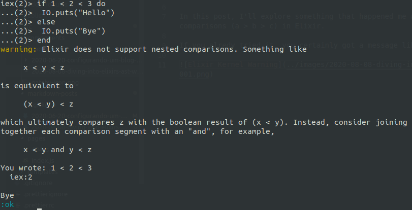

In this post, I'll explore something that happened me after trying to execute Python's nested comparisons (example: a > b > c) in Elixir.

If you alredy tried it, you certainly got a message like this one:



The most curious thing is that the `else` on this example was triggered, but `1 < 2 < 3` is `true`! This happened because Elixir actually processed something like the following way:

```elixir
first_result = 1 < 2 # returns true
first_result < 3 # compares "true < 3"
false # true is greater than 3 (?)
```

Before showing what I've developed to recreate this resource, first of all, it is interesting to see how a comparison looks like in the Elixir's **A**bstract **S**yntax **T**ree. Also, to simplify the example, I'll cover only nested comparisos for numbers (since the AST for variables is a little bit different).

```elixir
# if you type

iex(1)> quote do
...(1)> 1 < 2 < 3
...(1)> end

# it will return
{
  :<, # operator
  [context: Elixir, import: Kernel], # context
  [ # two items list (a value or another tuple)
    {
      :<,
      [context: Elixir, import: Kernel],
      [1, 2]
    },
    3
  ]
}
```

By knowing what is the format for this kind of operation (a tuple with: an operator atom, a context list, a list of args - that can be another tuple like this one described), now we can define what is needed to do:

- Do not import the `Kernel.if/2`
- Rewrite the `if` macro;
- Recursively look into the tuple shown above;
- Rewrite the ast into something Elixir knows:
 - I decided to create a list of tuples like this: `{:operator, left_arg, right_arg}`;
 - By the example above, when you have one item as a number (3) and another on a sub tuple, it is needed to combine the "real" args (1, 2, 3) in a way to have a pair for (1, 2) and another for (2, 3) - this way, the code could be rewritten to `1 < 2 and 2 < 3`;

The code is:

```elixir
defmodule Nested.Definition do
  @signals ~w/> < == != <= >=/a

  def decode_ast({signal, _context, [left_arg, right_arg]})
        when is_tuple(left_arg) and signal in @signals do
    {_signal, _context, [_left_arg, real_left_arg]} = left_arg
    decode_ast(left_arg) ++ [{signal, real_left_arg, right_arg}]
  end

  def decode_ast({signal, _context, [left_arg, right_arg]})
        when is_tuple(right_arg) and signal in @signals do
    {_signal, _context, [real_right_arg, _left_arg]} = right_arg
    [{signal, left_arg, real_right_arg}] ++ decode_ast(right_arg)
  end

  def decode_ast({signal, _context, [left_arg, right_arg]}) when signal in @signals do
    [{signal, left_arg, right_arg}]
  end
end

# And an example here:
Nested.Definition.decode_ast(quote do: 1 < 2 <= 3 <= 3 > 1 < 5)

# it will return the combination of each operation
# [{:<, 1, 2}, {:<=, 2, 3}, {:<=, 3, 3}, {:>, 3, 1}, {:<, 1, 5}]
```

The last thing now is to loop over the generated list and apply each operation to the pair of values, and also make it available inside `if` by redefining this macro. Include the following code on the module you already have:

```elixir
defmodule Nested.Definition do
  defmacro __using__(_args) do
    quote do
      import Kernel, except: [if: 2]
      import Nested.Definition, only: [if: 2]
    end
  end

  defmacro if(condition, clauses) do
    build_if(condition, clauses)
  end

  defp build_if(condition, do: do_clause) do
    build_if(condition, do: do_clause, else: nil)
  end

  defp build_if(condition, do: do_clause, else: else_clause) do
    final_result =
      condition
      |> decode_ast()
      |> Enum.reduce_while(true, fn {signal, left, right}, _acc ->
        # I used the reduce_while to avoid doing all comparisons
        # if some of them return false (so will stop by returning :halt)

        # to execute each operation, will apply it to erlang core module
        # like running :erlang.>=(3, 1)
        result = apply(:erlang, rewrite_operator(signal), [left, right])

        Kernel.if result do
          {:cont, result}
        else
          {:halt, result}
        end
      end)

    # lastely, unquote the code given in `do:` and `else:` keywords
    # on the main function
    quote do
      if unquote(final_result) do
        unquote(do_clause)
      else
        unquote(else_clause)
      end
    end
  end

  # this is used because erlang doesn't have
  # the "!=" operator, and uses "/="
  defp rewrite_operator(:!=), do: :"/="
  defp rewrite_operator(op), do: op
end
```

Now, it is possible to `use` this code on any module by typing:

```elixir
defmodule Nested do
  use Nested.Definition

  def test do
    if 1 < 2 >= 2 < 3 do
      IO.puts("IT REALLY WORKS!")
    end
  end
end
```

Finished! Just made a Python operator "works" in Elixir. But there are some problems that I avoided on this post, since I didn't want it to be a real/useful implementation because it is nicier to write the Elixir way (1 < 2 and 2 < 3), so:

- it doesn't work with variables (see the quoted expression using variables and will notice that the AST is different);
- by removing the Kernel implementation, some options like `if(true, do: IO.puts("true"))` just stopped working, since they don't match the `decode_ast` clauses.

If you want to check the full source, just visit my github https://github.com/duzzifelipe/ex_nested_operators.