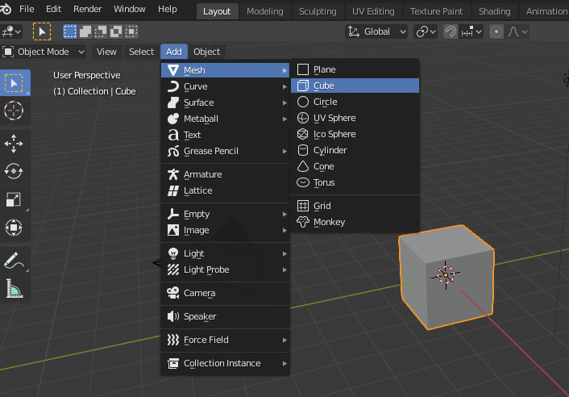
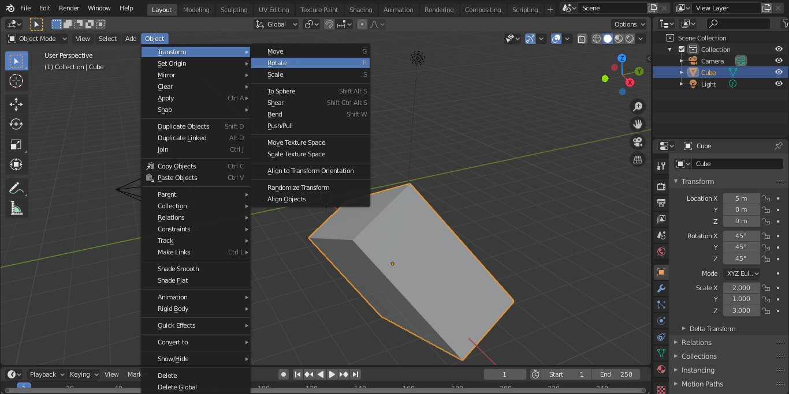
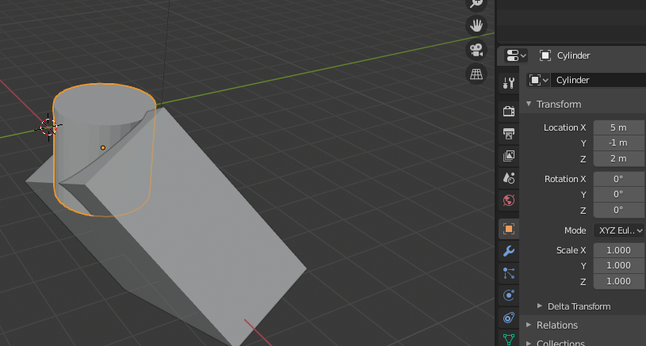
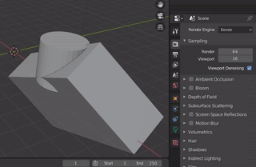
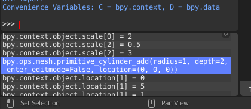
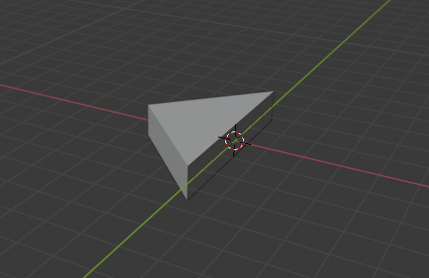
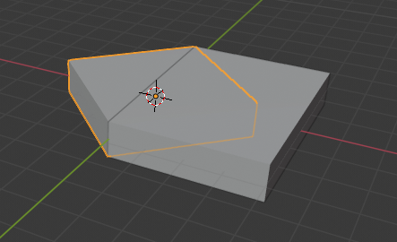
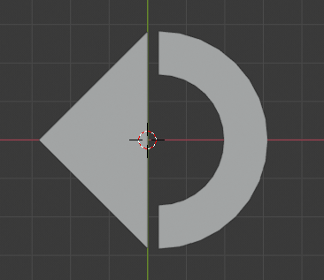

### Just a brief history

It is 2020 and I finally decided to buy my first 3D printer. The problem I had was: I didn't know how to draw anything and I also have no talent for anything related to arts.

Before buying it, I promised myself that I would learn how to do draw something in these 3D modeling softwares.

Yes, at this time I learned, built some cool things and I'm sharing this post If you have some interest on this subject.

## The software I choose

After some research, I came to Blender: a free and open source software for many purposes like video editing, sculpting and modeling. 

But the best part for me is: you can control blender just using code! For me, it was the key point, since I know how to code and I could see things in a more Exact Sciences way.

To get started with blender, download it here: https://www.blender.org/download/.

In this post I will show how to recreate the logo from the company I'm currently working to, Stone (because it is very easy to reproduce).

## Knowing your workspace

When you open the software for the first time, you sart with a sample cube. And you can add shapes like this cube, cylinder, on the menu `Add > Mesh > Cube` (like on the following image).



It is also important to know some commands like transformations of Rotate, Move and Scale. You can se on the right panel that there are 3 boxes (x, y and z) for each of these commands and its good to give it a try.



One last thing that is very important to proceed to the next steps is how to extrude objects (remove the intersection of an object from another one).

I added a cylinder by using something similar to what was made to the cube (`Add > Mesh > Cylinder`), and then moved it in a way to intersect with the cube I already have.



Finally, to extrude the second object from the first one, follow these steps:
1. click on the first object;
2. go on the right menu on the tool icon (Modifier Properties);
3. click on "Add Modifier";
4. choose "Boolean";
5. select the second object in "Object";
6. click apply;
7. delete the second object.



## Time to write code

If you're a developer, Blender gives you the best thing an editor could give: a code editor. On the top menu (on the middle-right of the screen) there is an option for `Scripting`. When in the scripting screen, just click on `New` and you will have an editor.

There is also a cool console on the bottom-left corner of the screen that shows a command for each command you execute by hand. In other words, everything we did on previous steps are logged there as a code that can be copied to execute as a script.



To recreate the logo I mentioned earlier, we first need a triangle. We will, by code, follow these steps:
- add a boilerplate code that always delete every object on screen (so we can run the script entirely many times we want);
- add a cube and rotate it;
- add another cube and move it to the middle of the another one;
- extrude the second from the first, to make it be a half square (a triangle).

```python
  import bpy
  import math

  for obj in bpy.data.objects:
      obj.select_set(True)
      bpy.ops.object.delete()

  size = 4
  height = 1
  # calculate the diagonal size
  side_size = math.sqrt(math.pow(size, 2) * 2)
  # it is a particularity when extruding objects
  # the one to be removed needs to be just a little bit bigger
  extrude_factor = 1.001

  ##
  ## Building the Triangle
  ##

  # First cube (rotated)
  bpy.ops.mesh.primitive_cube_add(size=1, enter_editmode=False, location=(0, 0, 0))
  first_cube = bpy.context.object # keep a reference for created object
  bpy.context.object.scale[0] = size # scale on the 3 dimensions, as made manually
  bpy.context.object.scale[1] = size
  bpy.context.object.scale[2] = height
  bpy.context.object.rotation_euler[2] = math.radians(45) # rotation command receives in radians

  # Second cube (moved to the side)
  bpy.ops.mesh.primitive_cube_add(size=1, enter_editmode=False, location=(size/2, 0, 0))
  second_cube = bpy.context.object
  bpy.context.object.scale[0] = size * extrude_factor
  bpy.context.object.scale[1] = side_size  * extrude_factor
  bpy.context.object.scale[2] = height * extrude_factor

  ##
  ## Finally extrude the objects and delete the second
  ##
  bpy.context.view_layer.objects.active = first_cube
  bpy.ops.object.modifier_add(type='BOOLEAN')
  bpy.context.object.modifiers['Boolean'].object = second_cube
  bpy.context.object.modifiers['Boolean'].operation = 'DIFFERENCE'
  bpy.ops.object.modifier_apply(apply_as='DATA', modifier="Boolean")

  bpy.context.view_layer.objects.active = second_cube
  bpy.ops.object.delete(use_global=False)
```

To run this script, jus click `ALT + P` and the preview will be updated to the triangle we want (by switching to "Layout" on the top menu):



You can try commenting out the last part when we extrude the objects and will see how both cubes are placed together:



For the last part I will just put the code here because it is a little bit bigger. This code will:
- create a cylinder;
- add a cylinder on the middle of it;
- extrude the second from the first (so it will be a circle with a hole);
- create a cube;
- remove the cube from half of the cylinder (so it will be half of the cylinder with a hole).

```python
# add this code to the end of what you have

radius = side_size / 2
cylinder_size = radius * 0.4
objects_dist_factor = 0.1

# create a cylinder with a hole
bpy.ops.mesh.primitive_cylinder_add(radius=radius, depth=height, enter_editmode=False, location=(0 + radius * objects_dist_factor, 0, 0))
first_cylinder = bpy.context.object

bpy.ops.mesh.primitive_cylinder_add(radius=radius - cylinder_size, depth=height * extrude_factor, enter_editmode=False, location=(0 + radius * objects_dist_factor, 0, 0))
second_cylinder = bpy.context.object

bpy.context.view_layer.objects.active = first_cylinder
bpy.ops.object.modifier_add(type='BOOLEAN')
bpy.context.object.modifiers['Boolean'].object = second_cylinder
bpy.context.object.modifiers['Boolean'].operation = 'DIFFERENCE'
bpy.ops.object.modifier_apply(apply_as='DATA', modifier="Boolean")

bpy.context.view_layer.objects.active = second_cylinder
bpy.ops.object.delete(use_global=False)

## remove left half
bpy.ops.mesh.primitive_cube_add(size=1, enter_editmode=False, location=(-size/2 + radius * objects_dist_factor, 0, 0))
third_cube = bpy.context.object

bpy.context.object.scale[0] = size *  extrude_factor
bpy.context.object.scale[1] = side_size * extrude_factor
bpy.context.object.scale[2] = height * extrude_factor

bpy.context.view_layer.objects.active = first_cylinder
bpy.ops.object.modifier_add(type='BOOLEAN')
bpy.context.object.modifiers['Boolean'].object = third_cube
bpy.context.object.modifiers['Boolean'].operation = 'DIFFERENCE'
bpy.ops.object.modifier_apply(apply_as='DATA', modifier="Boolean")

bpy.context.view_layer.objects.active = third_cube
bpy.ops.object.delete(use_global=False)
```

The result is the full Stone's logo:



## Bonus

If you (like me) want to 3D print it, you'll need to export this project to STL. You can also automate it to avoid the need of clicking on the menu everytime.

Just append this code to the end of your file and a STL with your project name's will be placed on the relative folder "./exported":

```python
##
## Export STL File
##

import os

path = bpy.path.abspath('//exported/')
project_name = bpy.path.display_name_from_filepath(bpy.data.filepath)

if not os.path.exists(path):
    os.makedirs(path)

bpy.ops.object.select_all(action='DESELECT')

bpy.ops.export_mesh.stl(
    filepath=str(path + project_name + '.stl'),
    check_existing=False,
    use_selection=False,
    global_scale=1
)
```

## Final toughts
Some commands used here, like scaling and extruding, can be isolated in a specific function, so the code size will be reduced.

Just to finish, a really liked to write these drawings using code, so when I need to resize, separate things or rollback something, I can just remove the code or change a variable without messing with 'CTRL + Z's or forgetting what was made befode.

Hope it help you on your projects!